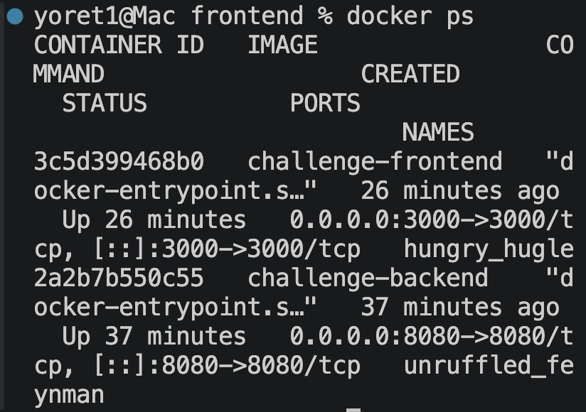
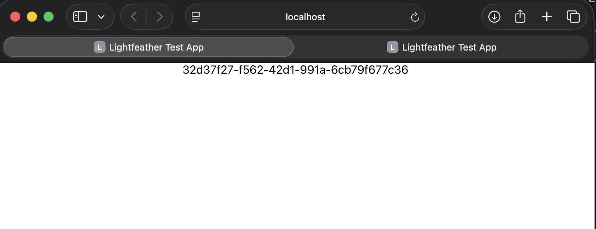
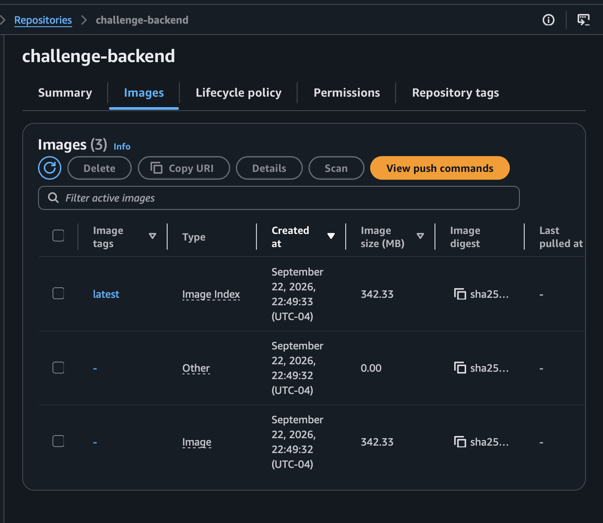
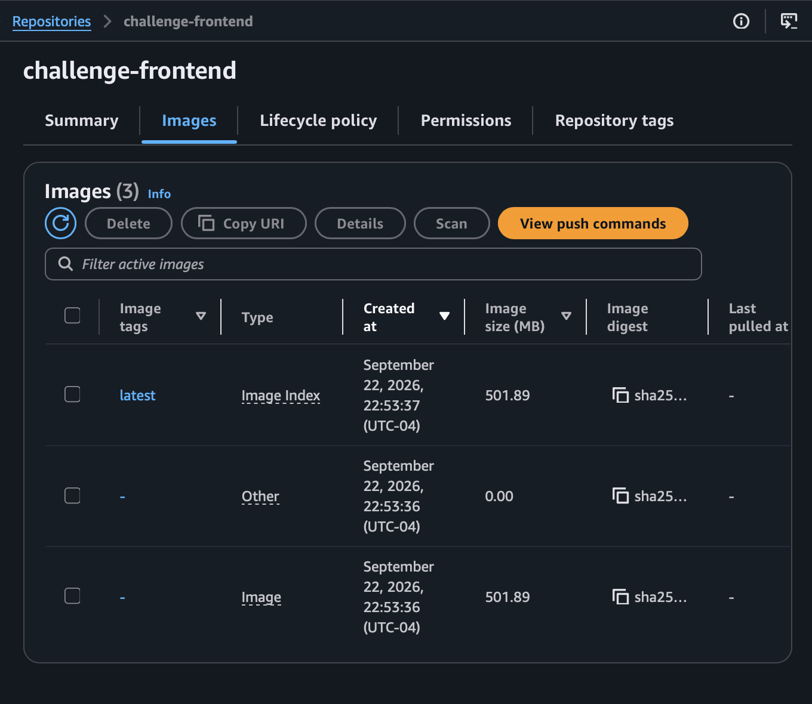
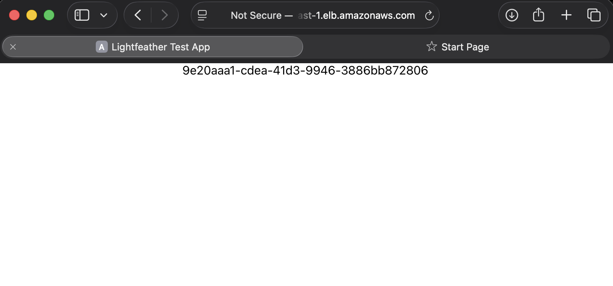
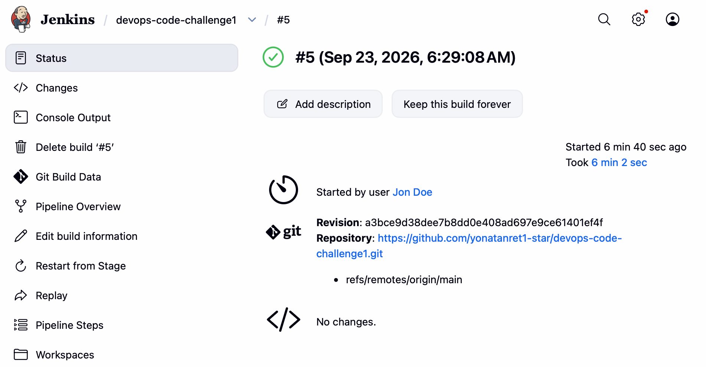
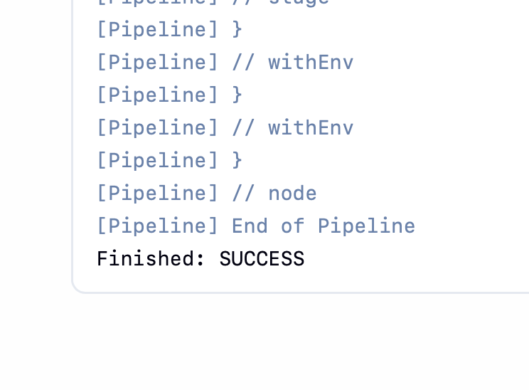
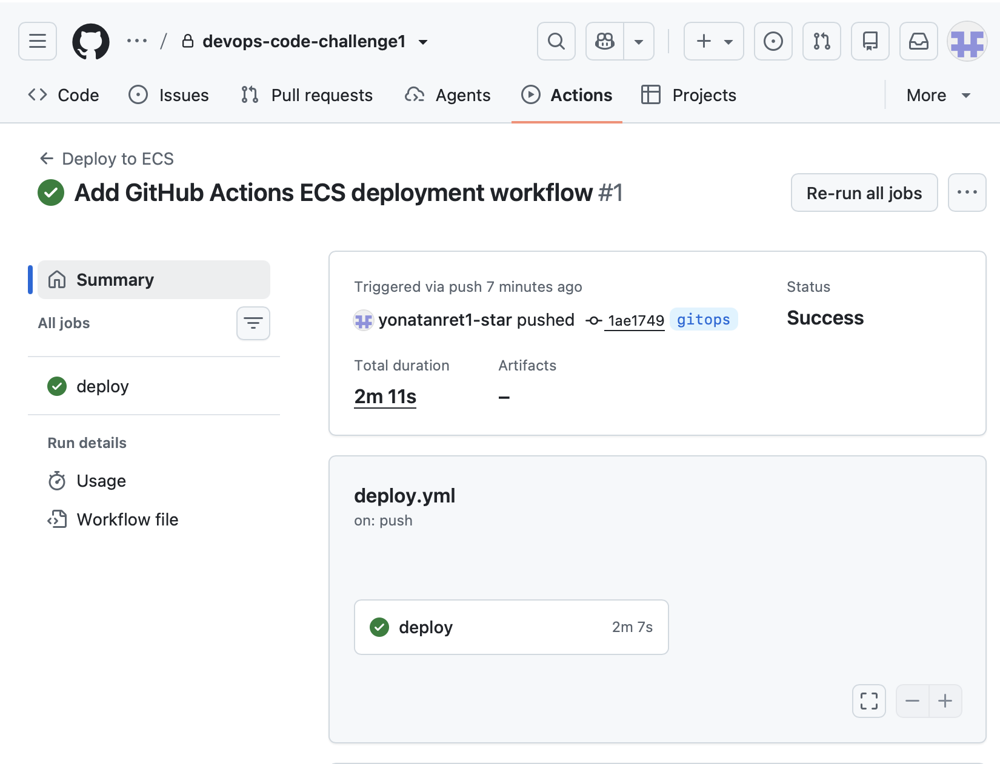
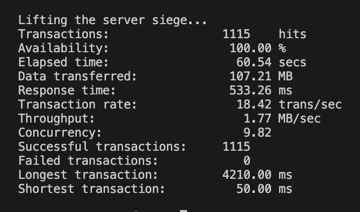

# DevOps Code Challenge

## Overview

This project demonstrates an end-to-end DevOps deployment workflow for a containerized web application using Docker, AWS, Terraform, Jenkins, and GitHub Actions.

The application consists of:

- React frontend
- Node.js / Express backend

The backend generates a GUID, and the frontend retrieves and displays that GUID.

The application was first tested locally, then containerized with Docker, stored in Amazon ECR, and deployed to Amazon ECS using Fargate.

Terraform was used to provision the AWS application infrastructure.

Two CI/CD approaches were implemented:

- Jenkins pipeline on the `main` branch
- GitHub Actions workflow on the `gitops` branch

Siege was also used to perform load testing against the deployed application.

---

## Technologies Used

- AWS ECS Fargate
- Amazon ECR
- Application Load Balancer
- Amazon VPC
- AWS IAM
- Amazon EC2
- Amazon CloudWatch
- Terraform
- Docker
- Jenkins
- GitHub Actions
- GitHub
- Siege
- React
- Node.js
- Express
- AWS CLI

---

## Architecture

```text
Developer
    |
    v
GitHub
    |
    +----------------------+
    |                      |
    v                      v
Jenkins                GitHub Actions
(main branch)          (gitops branch)
    |                      |
    +----------+-----------+
               |
               v
          Docker Build
               |
               v
          Amazon ECR
               |
               v
       Amazon ECS Fargate
               |
       +-------+-------+
       |               |
       v               v
Frontend Service   Backend Service
Port 3000          Port 8080
       |               |
       +-------+-------+
               |
               v
    Application Load Balancer
               |
               v
             User
```

The Application Load Balancer provides the public entry point to the application.

Routing is configured as:

```text
/        -> Frontend ECS service
/api/*   -> Backend ECS service
```

The frontend communicates with the backend through the same Application Load Balancer.

---

## Project Structure

```text
devops-code-challenge1/
├── backend/
│   ├── Dockerfile
│   ├── config.js
│   ├── index.js
│   └── package.json
│
├── frontend/
│   ├── Dockerfile
│   ├── src/
│   │   ├── App.js
│   │   └── config.js
│   └── package.json
│
├── terraform/
│   ├── autoscaling.tf
│   ├── ecs.tf
│   ├── iam.tf
│   ├── main.tf
│   ├── networking.tf
│   ├── outputs.tf
│   ├── terraform.tfvars
│   └── variables.tf
│
├── screenshots/
│   ├── local-docker/
│   ├── ecr/
│   ├── ecs/
│   ├── jenkins/
│   ├── github-actions/
│   └── siege-load-testing/
│
├── .github/
│   └── workflows/
│       └── deploy.yml
│
├── Jenkinsfile
├── .gitignore
└── README.md
```

---

# Local Application Testing

The frontend and backend were first tested locally before being deployed to AWS.

## Backend

```bash
cd backend
npm install
npm start
```

The backend runs on:

```text
http://localhost:8080
```

## Frontend

```bash
cd frontend
npm install
npm start
```

The frontend runs on:

```text
http://localhost:3000
```

The frontend successfully displayed the GUID returned by the backend.

---

# Docker

Dockerfiles were created for both application components.

## Build Backend

```bash
cd backend

docker build --platform linux/amd64 \
-t challenge-backend .
```

## Build Frontend

```bash
cd frontend

docker build --platform linux/amd64 \
-t challenge-frontend .
```

The `linux/amd64` platform was specified to ensure the images were compatible with the ECS Fargate runtime.

## Run Backend

```bash
docker run --rm \
-p 8080:8080 \
challenge-backend
```

## Run Frontend

```bash
docker run --rm \
-p 3000:3000 \
challenge-frontend
```

Running containers can be verified with:

```bash
docker ps
```

## Local Docker Containers



## Local Application



---

# Amazon ECR

Two Amazon ECR repositories were created:

```text
challenge-backend
challenge-frontend
```

Docker images were tagged and pushed to ECR.

## Authenticate Docker to ECR

```bash
aws ecr get-login-password \
--region us-east-1 | \
docker login \
--username AWS \
--password-stdin AWS_ACCOUNT_ID.dkr.ecr.us-east-1.amazonaws.com
```

## Tag Backend Image

```bash
docker tag challenge-backend:latest \
AWS_ACCOUNT_ID.dkr.ecr.us-east-1.amazonaws.com/challenge-backend:latest
```

## Push Backend Image

```bash
docker push \
AWS_ACCOUNT_ID.dkr.ecr.us-east-1.amazonaws.com/challenge-backend:latest
```

The same process was used for the frontend image.

## Backend ECR Image



## Frontend ECR Image



---

# Terraform Infrastructure

Terraform was used to provision the AWS application infrastructure.

The Terraform configuration creates:

- VPC
- Internet Gateway
- Public subnets
- Route tables
- Security groups
- Application Load Balancer
- Target groups
- ECS cluster
- ECS task definitions
- ECS services
- IAM roles
- CloudWatch log groups
- Application Auto Scaling

## Terraform Workflow

Initialize Terraform:

```bash
terraform init
```

Format the configuration:

```bash
terraform fmt
```

Validate the configuration:

```bash
terraform validate
```

Review the deployment plan:

```bash
terraform plan
```

Create the infrastructure:

```bash
terraform apply
```

Terraform then provisions the application infrastructure in AWS.

---

# Terraform File Organization

```text
main.tf
= AWS provider configuration

variables.tf
= Variable declarations

terraform.tfvars
= Variable values

networking.tf
= VPC, subnets, routes, security groups, and load balancer networking

iam.tf
= IAM roles and permissions

ecs.tf
= ECS cluster, task definitions, services, load balancer, and target groups

autoscaling.tf
= ECS application scaling configuration

outputs.tf
= Useful deployment outputs
```

---

# ECS and Fargate

The frontend and backend run as separate ECS services using AWS Fargate.

## Frontend

```text
Container port: 3000
CPU: 512
Memory: 1024 MB
Desired tasks: 1
```

## Backend

```text
Container port: 8080
CPU: 512
Memory: 1024 MB
Desired tasks: 1
```

Amazon ECS pulls the Docker images from Amazon ECR and runs them as Fargate tasks.

---

# Application Load Balancer

An Application Load Balancer routes incoming traffic to the correct ECS service.

```text
/        -> Frontend target group
/api/*   -> Backend target group
```

The frontend uses the same load balancer URL to communicate with the backend.

---

# Auto Scaling

Application Auto Scaling was configured for both ECS services.

```text
Minimum tasks: 1
Desired tasks: 1
Maximum tasks: 4
Target CPU utilization: 50%
```

If CPU utilization increases, ECS can increase the number of running tasks.

When load decreases, ECS can scale the services back down.

---

# AWS Hosted Application

The deployed application is accessible through the Application Load Balancer.

The frontend successfully communicates with the backend and displays the GUID returned by the backend service.



---

# Jenkins CI/CD Pipeline

Jenkins was installed on an Amazon EC2 instance and configured as the primary CI/CD server for the `main` branch.

The Jenkins server uses:

- Java 21
- Docker
- Git
- AWS CLI
- GitHub credentials
- EC2 IAM role

The Jenkins EC2 instance uses an IAM role named:

```text
JenkinsEcsDeployRole
```

The IAM role allows Jenkins to interact with Amazon ECR and Amazon ECS without storing AWS access keys directly inside the Jenkins pipeline.

---

# Jenkins Pipeline Workflow

The Jenkins pipeline configuration is stored in:

```text
Jenkinsfile
```

The pipeline performs the following workflow:

```text
GitHub Checkout
      |
      v
Amazon ECR Login
      |
      v
Build Backend Docker Image
      |
      v
Build Frontend Docker Image
      |
      v
Push Backend Image to ECR
      |
      v
Push Frontend Image to ECR
      |
      v
Redeploy Backend ECS Service
      |
      v
Redeploy Frontend ECS Service
```

ECS services are redeployed using commands such as:

```bash
aws ecs update-service \
--cluster devops-challenge-cluster \
--service SERVICE_NAME \
--force-new-deployment \
--region us-east-1
```

---

# Jenkins Deployment Evidence

The Jenkins pipeline successfully completed the Docker build, ECR push, and ECS deployment process.

## Successful Jenkins Build



## Jenkins Console Output

The Jenkins console confirms that the pipeline completed successfully.



---

# GitHub Actions GitOps Workflow

A separate GitOps deployment workflow was implemented using GitHub Actions.

The GitHub Actions version is maintained on the:

```text
gitops
```

branch.

The Jenkins solution remains on:

```text
main
```

The GitHub Actions workflow is stored in:

```text
.github/workflows/deploy.yml
```

The workflow automatically runs when changes are pushed to the `gitops` branch.

---

# GitHub Actions Workflow

The GitHub Actions workflow performs the following steps:

```text
Push to gitops branch
        |
        v
Checkout Repository
        |
        v
Configure AWS Credentials
        |
        v
Login to Amazon ECR
        |
        v
Build Backend Docker Image
        |
        v
Build Frontend Docker Image
        |
        v
Push Backend Image to ECR
        |
        v
Push Frontend Image to ECR
        |
        v
Force Backend ECS Deployment
        |
        v
Force Frontend ECS Deployment
```

The workflow uses GitHub repository secrets for AWS authentication:

```text
AWS_ACCESS_KEY_ID
AWS_SECRET_ACCESS_KEY
```

The credential values are not stored directly in the repository.

---

# GitHub Actions Deployment Evidence

The GitHub Actions workflow successfully completed the ECS deployment from the `gitops` branch.



This provides an alternative deployment method to the Jenkins CI/CD pipeline.

---

# Siege Load Testing

Siege was used to generate concurrent traffic against the deployed AWS application.

Siege was installed with:

```bash
brew install siege
```

The deployed Application Load Balancer endpoint was tested using:

```bash
siege -c 10 -t 1M http://<APPLICATION-LOAD-BALANCER-URL>/
```

The options used were:

```text
-c 10
= 10 concurrent users

-t 1M
= run the load test for 1 minute
```

## Siege Results

The test generated:

```text
Transactions:             1115
Availability:             100.00%
Elapsed time:             60.54 seconds
Data transferred:         107.21 MB
Average response time:    533.26 ms
Transaction rate:         18.42 transactions/sec
Throughput:               1.77 MB/sec
Concurrency:              9.82
Successful transactions:  1115
Failed transactions:      0
Longest transaction:      4210.00 ms
Shortest transaction:     50.00 ms
```

The application maintained:

```text
100.00% availability
0 failed transactions
```

during the Siege test.

## Siege Load Testing Evidence



---

# Troubleshooting

Several issues were identified and resolved during the project.

## Node.js Compatibility

### Issue

The frontend dependencies experienced compatibility problems when using Node.js 26.

### Solution

Node Version Manager was used to install Node.js 16.

```bash
nvm install 16
nvm use 16
```

---

## Docker Image Architecture

### Issue

Amazon ECS could not run the Docker image because the image architecture did not match the Fargate runtime.

The ECS service reported an error similar to:

```text
image Manifest does not contain descriptor matching platform 'linux/amd64'
```

### Solution

The Docker images were rebuilt explicitly for AMD64.

```bash
docker build \
--platform linux/amd64 \
-t challenge-backend .
```

and:

```bash
docker build \
--platform linux/amd64 \
-t challenge-frontend .
```

The rebuilt images were pushed to ECR and ECS was redeployed.

---

## ECS Backend 503 Error

### Issue

The Application Load Balancer returned:

```text
503 Service Temporarily Unavailable
```

because the backend task was not running successfully.

### Solution

The backend image was rebuilt for AMD64, pushed to ECR, and the ECS service was forced to redeploy.

```bash
aws ecs update-service \
--cluster devops-challenge-cluster \
--service devops-challenge-backend-service \
--force-new-deployment \
--region us-east-1
```

After the new task started successfully, the backend `/api/` endpoint returned a GUID.

---

## Frontend API Routing

### Issue

The frontend originally connected directly to:

```text
http://localhost:8080
```

which only works during local development.

### Solution

The frontend configuration was updated to use an environment variable.

```javascript
export const API_URL = process.env.REACT_APP_API_URL
  ? `${window.location.origin}${process.env.REACT_APP_API_URL}`
  : 'http://localhost:8080/'
```

The ECS task supplies:

```text
REACT_APP_API_URL=/api/
```

This allows the frontend to communicate with the backend through the Application Load Balancer.

---

## Backend CORS Configuration

### Issue

The backend CORS configuration was hardcoded for the local frontend.

### Solution

The configuration was changed to support an environment variable while keeping the local value as the fallback.

```javascript
module.exports = {
    CORS_ORIGIN: process.env.CORS_ORIGIN || 'http://localhost:3000'
}
```

---

## Jenkins Java Version

### Issue

The Jenkins version required a newer Java runtime.

### Solution

Java 21 was installed and verified with:

```bash
java -version
```

---

## Jenkins GitHub Branch

### Issue

Jenkins initially attempted to build the:

```text
master
```

branch.

The project uses:

```text
main
```

### Solution

The Jenkins SCM branch configuration was changed to:

```text
*/main
```

---

## Jenkins Disk Space

### Issue

The Jenkins EC2 root disk was nearly full.

Docker images and Jenkins build data required more storage.

### Initial Cleanup

```bash
docker system prune -a
```

### Final Solution

The EC2 EBS root volume was increased to approximately 20 GB and the Linux partition/filesystem was expanded.

Disk layout was checked with:

```bash
lsblk
```

---

## Jenkins Temporary Space

### Issue

Jenkins marked its built-in node offline because available temporary disk space was below the configured threshold.

### Solution

The Jenkins temporary-space monitoring threshold was adjusted to an appropriate value for the EC2 instance.

After the threshold was corrected and disk space was increased, the node returned online.

---

## Jenkins Frontend Build Memory Error

### Issue

The frontend Docker build failed with:

```text
exit code 137
```

This indicated that the process had been killed because the EC2 instance ran out of memory.

### Solution

A 2 GB swap file was added.

```bash
sudo fallocate -l 2G /swapfile

sudo chmod 600 /swapfile

sudo mkswap /swapfile

sudo swapon /swapfile
```

The swap configuration was made persistent:

```bash
echo '/swapfile none swap sw 0 0' | \
sudo tee -a /etc/fstab
```

Memory and swap were verified with:

```bash
free -h
```

After adding swap, the Jenkins pipeline completed successfully.

---

## GitHub Repository Remote

### Issue

The local Git repository originally pointed to the source challenge repository.

Push attempts failed because the repository was not owned by the project author.

### Solution

A private GitHub repository was created and configured as the new Git remote.

The project was then successfully pushed to the new repository.

---

## Terraform State Files

### Issue

Terraform state and provider files were accidentally added to Git.

### Solution

The following entries were added to `.gitignore`:

```gitignore
.terraform/
*.tfstate
*.tfstate.*
crash.log
```

Already tracked Terraform files were removed from Git tracking.

```bash
git rm -r --cached terraform/.terraform

git rm --cached terraform/terraform.tfstate
```

The Terraform lock file remained committed:

```text
terraform/.terraform.lock.hcl
```

---

## macOS Metadata Files

### Issue

macOS automatically created `.DS_Store` files inside the screenshots folders.

### Solution

The files were removed from Git and `.DS_Store` was added to `.gitignore`.

```gitignore
.DS_Store
```

Tracked copies were removed with:

```bash
git rm --cached screenshots/.DS_Store

git rm --cached screenshots/local-docker/.DS_Store
```

---

# Security

The project uses several security practices.

- GitHub repository is private during challenge evaluation.
- Jenkins uses an EC2 IAM role for AWS authentication.
- AWS access keys are not stored in the Jenkinsfile.
- GitHub Actions secrets are stored in GitHub repository secrets.
- AWS secret values are not committed to the repository.
- Terraform state files are excluded from Git.
- Terraform provider directories are excluded from Git.
- Jenkins access is controlled through the EC2 security group.
- ECS application traffic is controlled through security groups.
- Application containers receive traffic through the Application Load Balancer.

---

# Git Ignore

The repository excludes local dependency, Terraform state, and macOS metadata files.

```gitignore
node_modules/

# Terraform
.terraform/
*.tfstate
*.tfstate.*
crash.log

# macOS
.DS_Store
```

---

# Deployment Workflows

## Jenkins

```text
main branch
    |
    v
Jenkins
    |
    v
Docker Build
    |
    v
Amazon ECR
    |
    v
Amazon ECS
```

## GitHub Actions

```text
gitops branch
    |
    v
GitHub Actions
    |
    v
Docker Build
    |
    v
Amazon ECR
    |
    v
Amazon ECS
```

Both workflows ultimately deploy the frontend and backend containers to the same ECS environment.

---

# Infrastructure Cleanup

After completing the deployment, testing, and evidence collection, Terraform-managed AWS resources can be destroyed to avoid unnecessary AWS charges.

From the Terraform directory:

```bash
cd terraform
```

Review the resources currently managed by Terraform:

```bash
terraform state list
```

Destroy the Terraform-managed infrastructure:

```bash
terraform destroy
```

Review the destruction plan and enter:

```text
yes
```

when prompted.

Resources created manually outside Terraform, such as the Jenkins EC2 instance, should also be stopped or terminated separately when no longer required.

Other manually created resources should also be reviewed, including:

- Jenkins EC2 instance
- EBS volumes
- ECR repositories and images
- Elastic IP addresses, if used
- CloudWatch resources not managed by Terraform

---

# Result

This project demonstrates an end-to-end DevOps deployment workflow using:

```text
GitHub
   +
Docker
   +
Amazon ECR
   +
Terraform
   +
Amazon ECS Fargate
   +
Application Load Balancer
   +
Jenkins
   +
GitHub Actions
   +
Siege Load Testing
```

The application was successfully:

- run locally
- containerized with Docker
- stored in Amazon ECR
- deployed to ECS Fargate
- exposed through an Application Load Balancer
- provisioned using Terraform
- deployed through Jenkins
- deployed through GitHub Actions on a separate GitOps branch
- load tested with Siege
- documented with deployment evidence and troubleshooting information